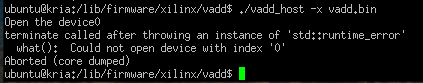
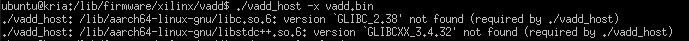
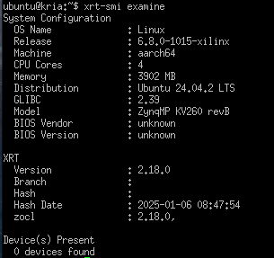
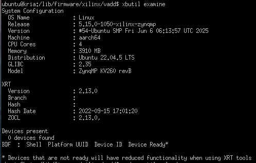
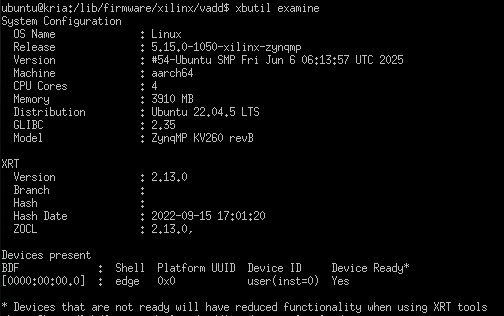
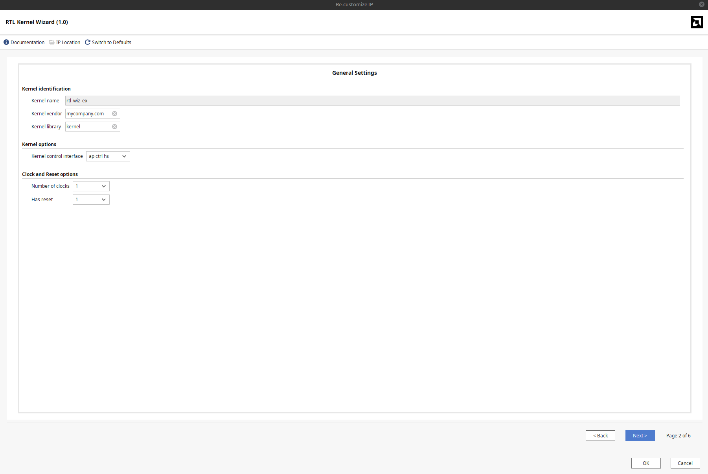
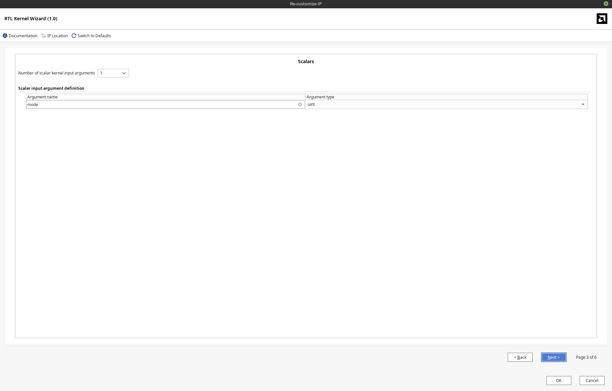
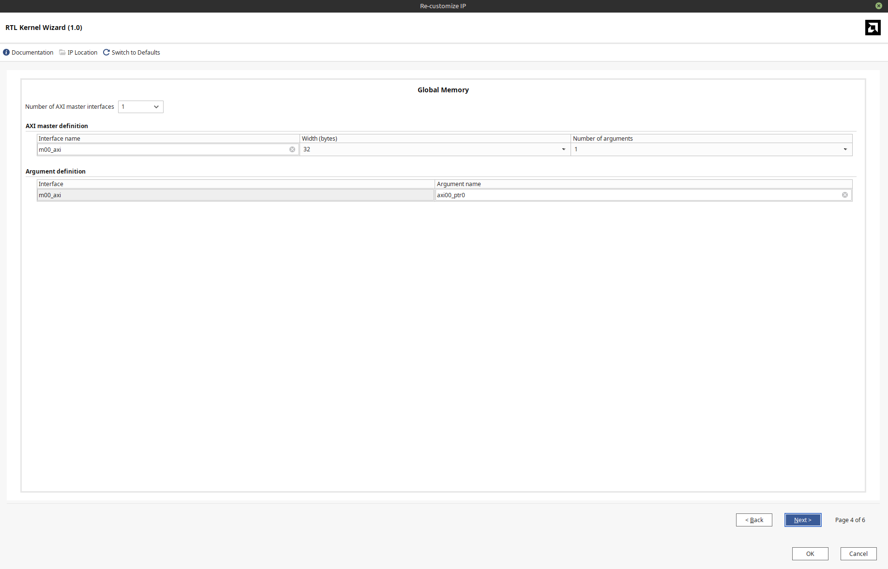
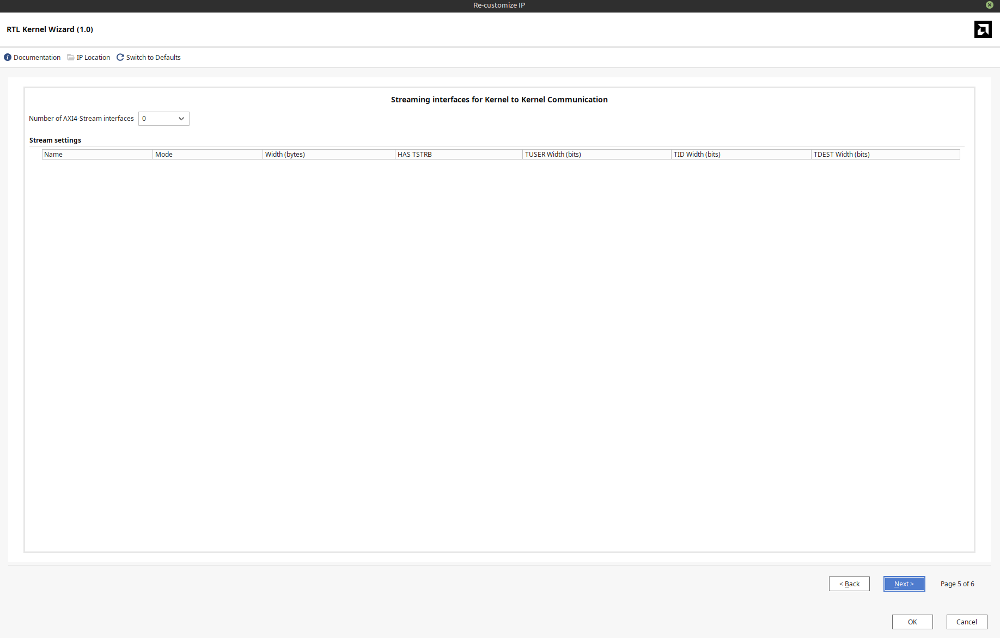

# An example project showing the flow through Vivado and Vitis for RTL kernels for the [AMD Kria KV260 FPGA](https://www.amd.com/en/products/system-on-modules/kria/k26/kv260-vision-starter-kit.html)
## In this guide I stitch together the documentation for Vivado and Vitis, showing how to create your own RTL kernel applications with the Kria KV260.

### Vivado/Vitis
An essential part of the design flow is using [Vivado](https://www.amd.com/en/products/software/adaptive-socs-and-fpgas/vivado.html) and [Vitis](https://www.amd.com/en/products/software/adaptive-socs-and-fpgas/vitis.html), you can download them at [this site](https://www.xilinx.com/support/download/index.html/content/xilinx/en/downloadNav/vivado-design-tools.html). In my example I use the 2025.1 versions of Vivado and Vitis.

#### Your OS
Vivado and Vitis are not supported with all OS version. You can find the list of supported OS versions [here](https://docs.amd.com/r/en-US/ug973-vivado-release-notes-install-license/Supported-Operating-Systems), I dont have any reccomendations for the OS to use but note that if you are not using one of the supported OS versions, AMD suppurt will not help you on the forums. 

#### Unsupported OS Versions
If you are trying to install Vivado and Vitis on an unsupported OS, it may not work and it may not be worth the effort. I use linuxmint 22.1 which is unsupported but I have gotten it to work. When installing some of the software, the scripts check for the OS you are using but you can trick them into installing anyways. This is done by changing your /etc/os-release file to make it look like it is a supported OS.
For example, on linuxmint 22.1, the os-release file is normally like
```
NAME="Linux Mint"
VERSION="22.1 (Xia)"
ID=linuxmint
ID_LIKE="ubuntu debian"
PRETTY_NAME="Linux Mint 22.1"
VERSION_ID="22.1"
HOME_URL="https://www.linuxmint.com/"
SUPPORT_URL="https://forums.linuxmint.com/"
BUG_REPORT_URL="http://linuxmint-troubleshooting-guide.readthedocs.io/en/latest/"
PRIVACY_POLICY_URL="https://www.linuxmint.com/"
VERSION_CODENAME=xia
UBUNTU_CODENAME=noble
```
and you only need to change the VERSION and the ID variables:
```
NAME="Linux Mint"
VERSION="24.04 LTS (Noble Numbat)"
ID=ubuntu
ID_LIKE="ubuntu debian"
PRETTY_NAME="Linux Mint 22.1"
VERSION_ID="22.1"
HOME_URL="https://www.linuxmint.com/"
SUPPORT_URL="https://forums.linuxmint.com/"
BUG_REPORT_URL="http://linuxmint-troubleshooting-guide.readthedocs.io/en/latest/"
PRIVACY_POLICY_URL="https://www.linuxmint.com/"
VERSION_CODENAME=xia
UBUNTU_CODENAME=noble
```
With this modified os-release file, the scripts will think the OS being used is Ubuntu 2024.04 LTS, which is one of the supported OS versions so they should be able to run. 
Once you are done with installing Vivado, Vitis, and XRT, you should change your os-release file back to normal.


#### Starting Vivado and Vitis
To start Vivado you must source the setting script from the location of your vivado download and it is similar for Vitis.
```
# To start Vivado
source /<path-to>/Xilinx/2025.1/Vivado/settings64.sh
vivado

# Similarly for Vitis
source /<path-to>/Xilinx/2025.1/Vitis/settings64.sh
vitis
```
If you are using Ubuntu or an ubuntu based OS (like linuxmint), you may ecounter the problems where Vitis exits immeadietly after trying to start it, I found [this workaround by user qaswara](https://adaptivesupport.amd.com/s/question/0D54U00008mtLFpSAM/vitis-20232-exits-immediately-on-ubuntu-2404-no-error-messages-displayed?language=en_US) worked for me.
```
source /<path-to>/Xilinx/2025.1/Vitis/settings64.sh
cd /<path-to>/Xilinx/2025.1/Vitis/ide/electron-app/lnx64
./vitis-ide --no-sandbox
```


#### Xilinx Runtime
The libraries that are used to interface between the Processing System (PS) and Programmable Logic (PL) are from [Xilinx Runtime (XRT)](https://github.com/Xilinx/XRT). To install XRT, follow these steps:
```
# Choose the location on your device you want to install XRT to and cd to it (I chose to install XRT in the directory /<path-to>/Xilinx/2025.1)
cd  /<path-to>/Xilinx/2025.1
# Clone the Github repo
git clone https://github.com/Xilinx/XRT.git
cd XRT
# Since I am using the 2025.1 version of Vivado and Vitis, I am installing the 2025.1 version of XRT. You change the version you are installing by selecting changing the branch you are on
git checkout 2025.1

# Now for the actual installation. The guide is at [this site](https://xilinx.github.io/XRT/master/html/build.html) but you can continue with my directions if you want and are on an ubuntu based OS.
# Note that if you are on an unsupported OS, you still need to have your /etc/os-release file edited to 
sudo /<path-to>/XRT/src/runtime_src/tools/scripts/xrtdeps.sh
# Note that when I was installing XRT, this script was not able to run fully. I had to comment out the function calls 'install_pybind11' at line 770 and 'install_hip' at line 772 and instead install these packages manually `sudo apt install pybind11-dev`, `sudo apt install libamdhip64-dev`.


# The next scripts require the XILINX_VITIS environment variable to be set up to work properly. You can set this variable with 
export XILINX_VITIS=/<path-to>/Xilinx/2025.1/Vitis

cd build
./build.sh

cd build/Release
make package
cd ../Debug
make package

# It's optional to build the documentation too, this is done in the build directory
cd ..   
./build.sh docs
# To browse the generated local documentation with a web browser:
xdg-open Release/runtime_src/doc/html/index.html
```
After this your software required on your PC is set up, remeber the location of your XRT installation so that you can properly point to the files later when including them in your code.
If you changed your /etc/os-release file, change it back to normal now.


### Setting up the FPGA
To get started with the FPGA, follow the Kria Ubuntu 22.04 Boot Linux Instructions found [here](https://xilinx.github.io/kria-apps-docs/kv260/2022.1/build/html/docs/linux_boot.html).
After you have finished with setting up the OS and updated firmware, the FPGA is ready to be used. 

You can use other OS versions for the FPGA if you want but for PS-PL applications, you need an OS that works with [XRT](https://github.com/Xilinx/XRT).

I tried using the Kria Ubuntu 24.04 boot linux instructions and I was able to load up linux but was unable to run PS-PL applications as the command `xrt-smi examine` indicated there were no devices found (this is covered later in this guide).


### Connecting to the FPGA
After the FPGA is set up, you are ready to connect it to your PC. For this you need an ethernet cable, a micro-USB to USB cable like the one from the [basic accessory pack](https://www.amd.com/en/products/system-on-modules/kria/k26/kv260-vision-starter-kit/basic-accessory-pack.html), and also the [power supply](https://www.amd.com/en/products/system-on-modules/kria/k26/kv260-vision-starter-kit/power-supply-adapter.html).

Connect the ethernet cable and micro USB into the FPGA, do not connect the usb end of the micro-USB to USB cable into your computer yet.

Plug the power cable into the FPGA and wait for it to boot up, when you can see the heartbeat led blinking, you can plug the USB end of the cable into your computer. 
```
# After you have plugged the USB cable into your PC, you need to identify which USB port the FPGA is using. You can use the command below to see the COM ports on your device.
dmesg | grep tty
# My FPGA is on /dev/ttyUSB1 so I use the command below to start my putty sessions.
sudo putty /dev/ttyUSB1 -serial -sercfg 115200,8,n,1,N
```

After you have started the putty session, log into the account you set up on the FPGA (typically ubuntu). 

For now you can turn off the FPGA and leave it off until after getting the output files from Vitis (make sure to use the `sudo shutdown -h now` command).

## Guide for Vivado and Vitis
I was originally trying to follow [this Custom Kria SOM Platform Creation Example](https://docs.amd.com/r/en-US/Vitis-Tutorials-Vitis-Platform-Creation/Custom-Kria-SOM-Platform-Creation-Example) to learn the flow from Vivado to Vitis better. When I tried to run the output files on my KV260 running the Kria ubuntu 2022 LTS OS, I encountered the following error. 



This is because the Kria ubuntu 2022 LTS only supports GLIBC_2.35 and GLIBCXX_3.4.30. I do not know what OS the guide is using but when I tried using the Kria ubuntu 2024 LTS, which does support the libraries, the application could not run as it could not identify any devices. 



To see whether your FPGA is ready to do PS-PL applications, you can use the `xbutil examine` command which is now `xrt-smi examine` on newer XRT versions.
If you see something like this image below, your PS-PL applications may not work:



The output should instead identify devices similarly to the photos below. The first photo is when the hardware is not loaded and the second is after loading the hardware with xmutil.

 
 

If you can see a device present when running `xbutil examine` or `xrt-smi examine`, your FPGA is ready.

### Getting the Xilinx Support Archive (.xsa) with Vivado
The .xsa file that I used is the one I made when following the above Custom Kria SOM Platform Creation Example. You can find the steps for [creating the Vivado hardware design and generating the XSA here](https://docs.amd.com/r/en-US/Vitis-Tutorials-Vitis-Platform-Creation/Step-1-Create-the-Vivado-Hardware-Design-and-Generate-XSA). 


### Getting the Xilinx Object (.xo) file with the Vivado RTL Kernel Wizard
When creating your own custom RTL kernels that interface with the PS, the way to get the .xo file is with the [RTL Kernel Wizard](https://docs.amd.com/r/2022.1-English/ug1393-vitis-application-acceleration/RTL-Kernel-Wizard).

I went with the following options in the RTL Kernel Wizard







